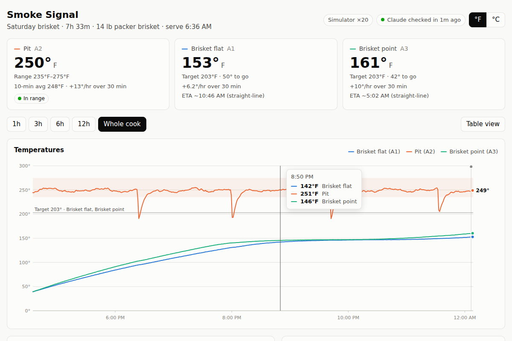
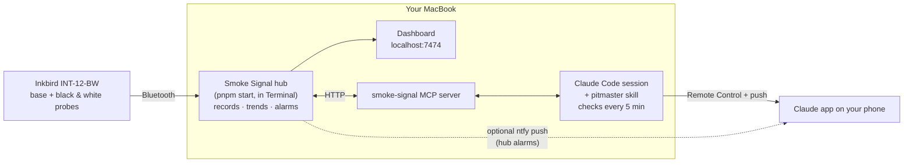

# 🔥 Smoke Signal

**Let Claude babysit your smoker.**

- Smoke Signal connects your MacBook to an **Inkbird INT-12-BW** Bluetooth meat thermometer, records the whole cook, and draws a live graph.
- It gives **Claude** tools to read the temperatures.
- Claude checks the cook every 5 minutes. It stays quiet while things are on track.
- When the fire is dying, the pit is running hot, the brisket has hit the stall or it's time to pull the meat, Claude tells you exactly what to do and buzzes your phone.
- You can chat with it from the Claude app on your phone.





## Why it's built this way

Your original idea (a Bluetooth CLI plus a Claude skill that polls every few minutes, used from the Claude app on your phone) is basically right. A few details had to change to make it work reliably:

| Idea | Reality | So Smoke Signal… |
|---|---|---|
| Claude Desktop chat polls every 5–10 min | A chat only runs when you send a message. Claude Desktop's scheduled tasks run hourly at most. | Uses **Claude Code**, which is included in Pro/Max and also available as the Code tab of the desktop app. Its session scheduler (`CronCreate` / `/loop`) runs a check-in every 5 minutes. |
| Talk to it from the mobile app | Claude Code's **Remote Control** puts the running session in the Claude iOS/Android app, and Claude Code can push notifications to your phone. | The skill sets that up and uses push notifications for "do this now" moments. |
| The skill talks to Bluetooth | macOS only grants Bluetooth to the app that launched a process. Things launched by the Claude app may be refused. | The **hub** runs in its own Terminal window and owns Bluetooth. Claude talks to it through a small **MCP server** over localhost. |
| Two thermometers | The INT-12-BW is **one base station with two probes**: black = meat + ambient/pit, white = meat. | Reads all three sensors from the base: channels **A1** (black tip), **A2** (black ambient = pit), **A3** (white tip). A second kit shows up as B1–B3. |
| Claude watches everything | An LLM loop can stall (Mac asleep, session closed, a permission prompt). | The hub has its own **alarms** (target reached, pit low/high/falling, signal lost…). They go to macOS notifications and, optionally, your phone via ntfy. It also warns you if **Claude stops checking in**. |

## What you need

- A Mac with Bluetooth. The hub also runs on Linux, and the simulator runs anywhere.
- **Node.js 22.18 or newer** (`brew install node`) and **pnpm** (`brew install pnpm`).
- **Claude Code** signed in with your Claude subscription, and the **Claude app** on your phone.
- An **Inkbird INT-12-BW**. The older Inkbird iBBQ family (IBT-2X / 4XS / 6XS) is also supported.

## Quick start

```bash
git clone https://github.com/tysonjf/Smoke-Signal-Cooking-Guide.git smoke-signal
cd smoke-signal
pnpm install
pnpm demo          # simulator, one cook-hour per real minute — open http://localhost:7474
```

`pnpm demo` starts five hours into a simulated brisket cook. About 40 simulated minutes in, the fire starts to die, so you can watch the alarms work. Log a note containing "fuel" in the dashboard to refuel the virtual fire, or "wrap" to wrap the meat. Stop it with Ctrl+C.

Then configure it once:

```bash
pnpm configure     # °F/°C, optional phone push, adds Smoke Signal to the Claude desktop app
```

## Cook day

1. **Close the INKBIRD phone app.** The base only accepts one Bluetooth connection. Take a probe out to wake the base.
2. **Start the hub** in its own Terminal window and leave it running:

   ```bash
   pnpm start
   ```

   - The first time, macOS asks whether your terminal may use Bluetooth. Click **Allow**.
   - The terminal shows a live status block. The dashboard is at <http://localhost:7474>; `pnpm start --lan` also lets your phone open it over Wi-Fi, read-only.
   - The hub keeps the Mac awake while it runs. Keep the Mac plugged in with the lid open.
3. **Start Claude Code** in the same folder, in a second terminal tab:

   ```bash
   claude --rc
   ```

   Trust the folder and approve the `smoke-signal` MCP server if asked. Then tell it what's on:

   ```
   /pitmaster start 14 lb packer brisket on the offset with post oak, pit at 250, want to eat at 6pm. Black probe in the flat, white in the point.
   ```

   Claude will:
   - confirm targets (e.g. pull at 203°F, pit range 235–275°F)
   - start the cook in the hub, which arms the alarms
   - **schedule a check-in every 5 minutes**
4. **On your phone**, open the Claude app and find the session (Remote Control). In Claude Code run `/config` and turn on **Push when Claude decides**, so action items buzz your phone.

During the cook:

- **Talk to it any time**, from the laptop or your phone: "how's it looking?", "I wrapped it in butcher paper", "added two splits", "when will it be done?", "should I wrap now?".
- **Check-ins cost almost nothing when all is well.** Claude gets a 4-line brief and replies with one line. When something needs attention, the full report comes back with rates, stall detection, ETA and events, and Claude tells you what to do.
- **When you're done**, run `/pitmaster stop` (or say "it's off"). Claude cancels the check-ins, closes the cook with notes for next time, and gives you the rest and hold plan.

### What a check-in looks like

```
✅ 2:35 PM · Pit 248°F steady · Flat 161°F (stall, +1°F/hr) · Point 165°F (+3°F/hr)
```

```
🔥 Add fuel now: pit is 219°F and falling ~45°F/hr. Your fire's burning down. Add two
pre-warmed splits and open the intake a little; it should turn around within 10–15 min.
I'll check again at 3:05.
```

## Alarms (they work even without Claude)

| Alarm | When |
|---|---|
| Target reached / almost done | A meat probe reaches its target, or gets within ~5°F of it |
| Pit running low / high | More than 10 min below, or 5 min above, the pit range. The warm-up at the start is ignored until the pit first reaches range |
| Pit falling steadily | Sustained drop (fire dying). Lid-open dips that recover are ignored |
| Meat temperature falling | Probe shifted, meat out of the heat, or the pit's too cool |
| Lost signal | A probe stops reporting for 2+ min (a probe put back in its dock is fine) |
| Battery low | Base or probe below 15% |
| Claude stopped checking in | No check-in for 20 min during a cook |

Where they go:

- a **macOS notification**, plus a spoken alarm if you set `"speak": true`
- the **dashboard**
- the **Claude session**
- your **phone via [ntfy](https://ntfy.sh)**, if you turned it on in `pnpm configure` (free app, no account)

## Using the Claude desktop app instead

`pnpm configure` adds the Smoke Signal MCP server to the Claude desktop app. Restart the app, then ask "how's the cook?" in any chat, or use the `monitor_cook` / `check_in` prompts from the ➕ menu. To get the same guidance there, upload `dist/pitmaster-skill.zip` under **Settings → Capabilities → Skills**, if your plan shows Skills.

The desktop **chat** can't schedule its own 5-minute check-ins. For automatic monitoring, use Claude Code: either the terminal (`claude --rc`) or the **Code** tab of the desktop app pointed at this folder, which picks up `.mcp.json` and the skill automatically. Either way, keep the hub running in Terminal.

## Commands

| Command | What it does |
|---|---|
| `pnpm start` | Hub: connect to thermometers, record, dashboard + API, alarms. Options include `--lan`, `--port 8080`, `--unit C`, `--open` and `--verbose` |
| `pnpm demo` / `pnpm sim` | Same hub, fed by the smoker simulator (`--speed N`, `--start-hours H`) |
| `pnpm status` | Print the current cook report (what Claude sees) |
| `pnpm scan` | List Bluetooth devices the Mac can see and which ones are supported |
| `pnpm explore` | Connect to the thermometer and log everything it says to `~/.smoke-signal/explore-*.log` (troubleshooting) |
| `pnpm configure` | Units, phone push, Claude desktop integration, skill zip |
| `pnpm check` | Typecheck and tests |

Options go straight after the script, e.g. `pnpm start --lan` or `pnpm scan --all`.

## Troubleshooting

- **"macOS blocked Bluetooth for this terminal"**: go to System Settings → Privacy & Security → Bluetooth, allow Terminal (or iTerm, Ghostty…), then quit and reopen it.
- **Thermometer not found**:
  - Fully close the INKBIRD app. The base allows one connection at a time; the app may still work over Wi-Fi.
  - Take a probe out of the base to wake it.
  - Stay within about 10 m.
  - `pnpm scan` shows what the Mac can hear.
- **Readings look wrong, or it keeps reconnecting**: run `pnpm explore` and ask Claude Code in this folder to fix it; the `thermometer-lab` skill walks it through the logs. The INT-12-BW protocol is in [docs/inkbird-int-12-bw-protocol.md](docs/inkbird-int-12-bw-protocol.md).
- **Claude says the hub isn't running**: start `pnpm start` in Terminal. Check `pnpm status`.
- **Check-ins stopped**: the Claude Code session was closed, the Mac slept, or Claude is waiting on a prompt. The hub will have alerted you. Restart with `claude --continue --rc` and say "resume monitoring".
- **No macOS notifications**: allow notifications for "Script Editor" in System Settings → Notifications, since Smoke Signal posts them via AppleScript.

## Data and privacy

- Everything is stored locally in `~/.smoke-signal/`: `config.json` and one folder per cook with `cook.json`, `samples.jsonl` and `events.jsonl`.
- Restarting the hub resumes the current cook.
- Temperatures only leave your Mac:
  - when Claude reads them, as part of your Claude conversation
  - via ntfy pushes, if you turned them on

## Development

```
bin/smoke-signal.mjs     entry point (Node version check → src/cli.ts)
src/cli.ts               commands
src/devices/             Bluetooth (ble.ts), protocols/ (INT-12-BW, iBBQ), simulator (sim.ts), scan/explore tools
src/hub/                 hub.ts (orchestration), store.ts (JSONL), analytics.ts (rates, stall, dips, ETA),
                         alarms.ts, report.ts (what Claude reads), server.ts (HTTP + SSE), terminal.ts, notify.ts
src/mcp/server.ts        MCP server (no Bluetooth in here, on purpose)
src/setup/               pnpm configure, Claude desktop config, skill zip
web/                     dashboard (vanilla JS + SVG chart)
.claude/skills/          pitmaster (the cook skill) and thermometer-lab (hardware debugging)
test/                    protocol vectors, analytics/alarms, end-to-end MCP test
```

- Node runs the TypeScript directly (type stripping), so there's no build step.
- `pnpm check` must pass.
- Temperatures are °C internally and converted only for display.

## Credits

- **INT-12-BW Bluetooth protocol** (auth handshake, frame layouts): reverse-engineered by Paul Faure in [paul43210/inkbird-bw-ble](https://github.com/paul43210/inkbird-bw-ble). Smoke Signal's driver is an independent TypeScript implementation, tested against the captured handshake vectors published there.
- **iBBQ protocol**: community documentation (go-ibbq, Adafruit_CircuitPython_BLE_iBBQ, cloudbbq).
- **Bluetooth on macOS**: [@stoprocent/noble](https://github.com/stoprocent/noble).

Not affiliated with Inkbird or Anthropic.
